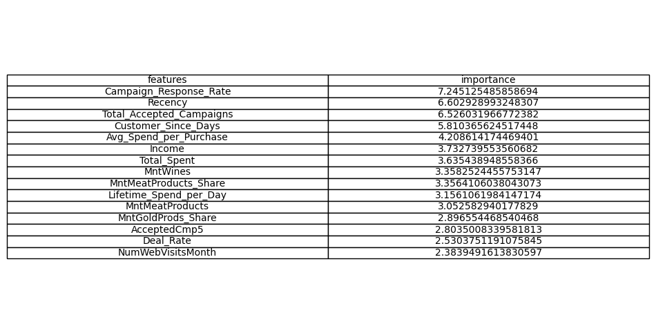

# 
Customer Relationship Management (CRM) Analysis for Marketing data

## PROBLEM STATEMENT

I’m a data analyst, and the Chief Marketing Officer has told me that previous marketing campaigns have not been as effective as they were expected to be. I need to analyze the data set to understand this problem and propose data-driven solutions.

## BRIEF

1. Performed `Data Exploration` and `Segmentation` to study the key characteristic features of `Potential customers` using Python.
2. Executed `Hypothesis Testing`, `Statistical Analysis`, `Anomaly Detection and Trend Analysis`, and `Feature Engineering` to identify sequential demand patterns and Customer Behavior.
3. Calculated the top 10 Informative features using `Random Forest Feature Importance`.
4. Detected `Successful Marketing Channels` and `Underperforming Marketing Campaigns`.
5. Designed Interactive dashboards using `Flourish` to analyze the trends, give recommendations and publish the findings.

## DATA DESCRIPTION

The dataset for this project is provided by Dr. Omar Romero-Hernandez. It is licensed as CC0: Public Domain.

The dataset is collected from kaggle - https://www.kaggle.com/datasets/jackdaoud/marketing-data?taskId=2986

1. ID: Customer’s unique identifier
2. Year_Birth: Customer’s birth year
3. Education: Customer’s education level
4. Marital_Status: Customer’s marital status
5. Income: Customer’s yearly household income
6. Kidhome: Number of children in customer’s household
7. Tennhome: Number of teenagers in customer’s household
8. Dt_Customer: Date of customer’s enrollment with the company
9. Recency: Number of days since customer’s last purchase
10. MntWines: Amount spent on wine in the last 2 years
11. MntFruits: Amount spent on fruits in the last 2 years
12. MntMeatProducts: Amount spent on meat in the last 2 years
13. MntFishProducts: Amount spent on fish in the last 2 years
14. MntSweetProducts: Amount spent on sweets in the last 2 years
15. MntGoldProds: Amount spent on gold in the last 2 years
16. NumDealsPurchase: Number of purchases made with a discount
17. NumWebPurchase: Number of purchases made through the company’s website
18. NumCatalogPurchase: Number of purchases made using a catalog
19. NumStorePurchase: Number of purchases made directly in stores
20. NumWebVisitsMonth: Number of visits to company’s website in the last month
21. AcceptedCmp3: 1 if customer accepted the offer in the 3rd campaign, 0 otherwise
22. AcceptedCmp4: 1 if customer accepted the offer in the 4th campaign, 0 otherwise
23. AcceptedCmp5: 1 if customer accepted the offer in the 5th campaign, 0 otherwise
24. AcceptedCmp1: 1 if customer accepted the offer in the 1st campaign, 0 otherwise
25. AcceptedCmp2: 2 if customer accepted the offer in the 1st campaign, 0 otherwise
26. Response: 1 if customer accepted the offer in the last campaign, 0 otherwise
27. Complain: 1 if a customer complained in the last 2 years, 0 otherwise
28. Country: Customer’s location

## METHODOLOGY

#### 1. Marketing Analysis.ipynb - 

#### A) Data Cleaning:

- Renamning Columns

- String Manipulations

- Missing values (Imputing with Median)

- DataType Conversion

#### B) Exploratory Data Analysis (EDA):

- Outlier Analysis (Replacing with median)

- `Feature Engineering`

- `Anomaly Detection and Trend Analysis`

- `Correlation Analysis`

#### C) Performing Statistical Analysis:

- Calculating `r` and `P-values`

- `Feature Importance (Using Random Forest)`

We can now see that the top 7 factors are:

1. Average order volume
2. Total amount spent in the last two years
3. Total number of purchases in the last two years
4. Amount spent on wine in the last 2 years
5. Number of purchases made using a catalog
6. Number of visits to company's web site in the last month
7. Total number of purchases through website in the last two years

However, we can’t tell whether each factor is positively or negatively correlated to the number of store purchases. We can use SHAP to explain it.

Finding:

1. The number of store purchases increases with the higher total amount spent(Total_Mnt), higher total purchase amount(Total_num_purchase), higher AOV, and higher amount of wines purchases(MntWines).
2. The number of store purchases decreases with more website visits(NumWebVisitsMonth), a higher number of purchases through the catalog(NumCatalogPurchases), and a higher number of purchases through websites(NumWebPurchases).

`Summary:` People who mostly shop at stores tend to buy more wines, have a higher average order volume, and shop less through the internet or catalog.

#### - Amount of Gold V/s Purchases

As we can see, there is a very vague trend that says as MntGoldProds increases, NumStorePurchases also increases. Now, let’s look at the correlation test.

* Pearson correlation (r):  0.38326418634704296
* Pearson p-value:  3.4668974417790955e-79

We got a Pearson correlation of 0.38 and a p-value of almost zero, which states that they are statistically significant and have a positive correlation. (If the p-value is > 0.05, we will fail to reject the null hypothesis, where they do not correlate.)

#### - Amount of Omega 3 V/s Consumption by Couples who are Married and education status is PhD

This plot shows that the rest of the customers spent more on fish products as its 50th percentile is higher than the married Ph.D. group.

#### D) Data Visualization:

#### - `Successfull Marketing Campaign`

Response means the last marketing campaign, which is the most successful one. It performed nearly twice as well as the previous campaigns, except campaign 2.

#### - What does an `Average customer look like for his company?`

An average customer...

* has an annual income of 52200 dollars
* had purchased 49 days ago
* has an AOV of 26.8 dollars
* has spent 605 dollars
* has purchased 20 times
* became a customer in mid-June
* became a customer on Thursday
* spent most on wines(300 dollars) and then * meat products(165 dollars)
* spent least on fruit(26 dollars) and sweet products(27 dollars)

#### - Finding `Underperforming Marketing Channels`

## CLASSIFICATION ALGORITHMS 

1. Logistic Regression - 

Fitting 10 folds for each of 20 candidates, totalling 200 fits  
{'C': 1.1, 'penalty': 'l1', 'solver': 'liblinear'}  
Logistic Regression Train score: 87.5  
Logistic Regression Cross validation score: 89.05527915975678  
`Testing Accuracy: 85.71428571428571 ` 

2. Support Vector Machine - 

Fitting 10 folds for each of 60 candidates, totalling 600 fits  
{'C': 0.8, 'degree': 3, 'kernel': 'linear'}  
Support Vecktor Classification Cross validation score: 88.98231066887783  
`Testing Accuracy: 86.49553571428571` 

3. XGBoost - 

Fitting 10 folds for each of 24 candidates, totalling 240 fits  
{'learning_rate': 0.1, 'max_depth': 3, 'n_estimators': 50}  
XGB Classifier Cros validation score: 89.2072968490879  
`Testing Accuracy: 86.49553571428571`  

4. Random Forest Regressor - 

Fitting 5 folds for each of 36 candidates, totalling 180 fits  
GridSearchCV(cv=5, estimator=RandomForestClassifier(random_state=5),  
             param_grid={'criterion': ['gini'], 'max_depth': [None, 3, 5, 8],  
                         'max_features': ['auto'],  
                         'min_samples_split': [2, 3, 4],  
                         'n_estimators': [50, 100, 200]},  
             verbose=1)  
`Testing Accuracy: 0.8616071428571429`  

## FEATURE IMPORTANCE

We have computated feature importance using Recurssive Feature Elimination method (along with the best params selected for random forest regressor).

## CONCLUSION

`Patterns:`

1. High-Income People
— tend to spend more and purchase more.
— tend to visit the company’s website less frequently than other people.
— tend to has few numbers of purchases made with a discount

2. People having kids at home
— tend to spend less and purchase less.
— tend to has a high number of purchases made with a discount

3. People who purchased with high average order volume
— tend to buy more wines and meat products
— tend to make a high number of purchases made using a catalog
— tend not to visit the company’s website.

`Anomalies:`

1. Intuitively, I’d think the more complaints a customer has, the less they may spend on our store, but the number of complaints in the last two years has almost no correlation with the total amount spent in the last two years.

After further investigating the data, I found that it is because we only have 20 customers who complained in the last two years, but we have 2200 customers in total. So, because of the imbalanced ratio, they don’t correlate. The customer service department in the company has done a wonderful job in the last two years.

